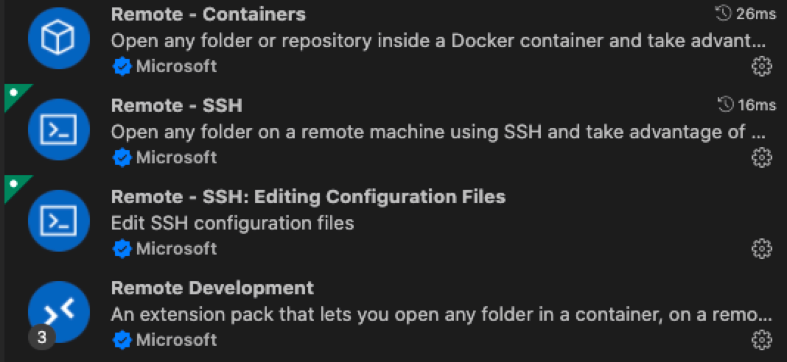
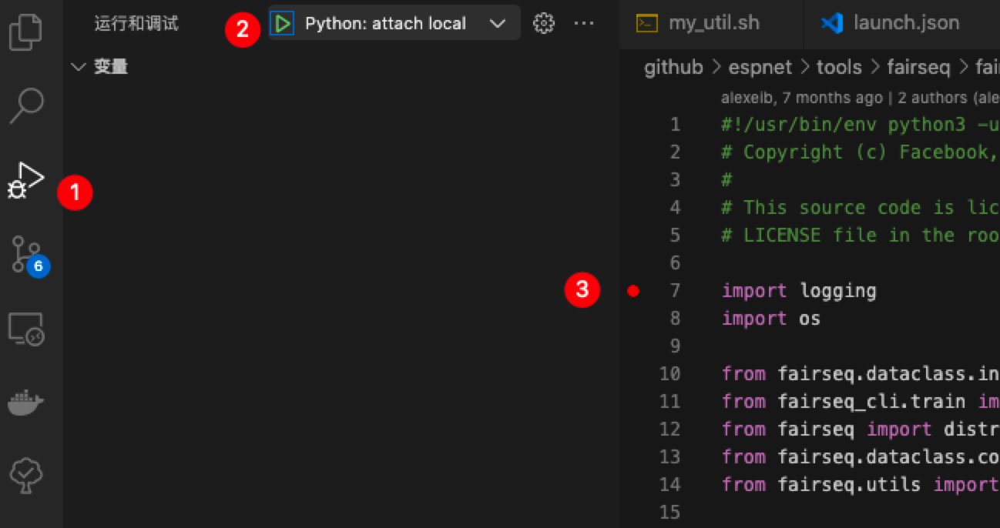
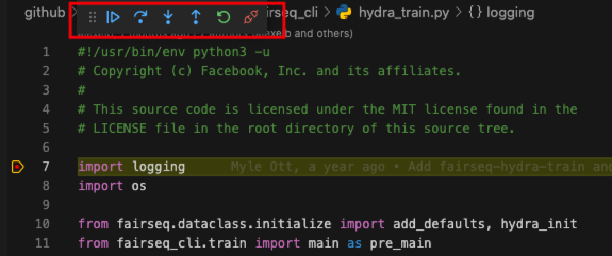

# Docker

## Basic

    # list image
    docker image ls
    # list container
    docker ps -a
    # delete image
    docker rmi <image_id>  
    # delete container
    docker rm <container_id> 
    # build image from dockerfile
    docker build -t <image_name> .
    # tag a image
    docker tag <image_name>:latest <repo>/<image_name_2>:<id>
    # eg. :docker tag pre-train:latest zym22/pre-train:20220218
    # push the image to dockerhub
    docker push  <repo>/<image_name_2>:<id>
    # built a container from image
    docker run -it --runtime=nvidia --name pre-train \
        --mount src=/mnt/xlancefs/home/zym22/data,target=/data/zym22,type=bind \
        --mount src=/mnt/xlancefs/home/xc095/data,target=/data/xc095,type=bind \
        -v /mnt/xlancefs/home/zym22:/home/zym22 \
        -p 12345:22 \
        --ipc=host \
        zym22/pre-train:latest /bin/bash

## docker run

这段Bash代码是用来运行一个Docker容器的命令行指令。我将一行行地解释这个命令：

1. `docker run`：这是Docker的命令，用于运行一个新的容器。

2. `-it`：这是两个参数的组合。`-i` 表示交互模式，允许你与容器进行交互；`-t` 分配一个伪终端或终端，这样做可以让你像在普通终端中那样使用容器。

3. `--runtime=nvidia`：这个参数指定Docker容器应该使用NVIDIA的运行时环境。这通常用于让容器可以访问宿主机的NVIDIA GPU，以便进行深度学习或其他需要GPU加速的任务。

4. `--name pre-train`：这个参数为运行中的容器指定了一个名称，这里的名称是`pre-train`。

5. `--mount src=/mnt/xlancefs/home/zym22/data,target=/data/zym22,type=bind`：这个参数挂载了宿主机的目录`/mnt/xlancefs/home/zym22/data`到容器中的`/data/zym22`目录。`type=bind`表明这是一个绑定挂载，即源目录和目标目录会指向文件系统中相同的位置。

6. `--mount src=/mnt/xlancefs/home/xc095/data,target=/data/xc095,type=bind`：同上，这个参数挂载了宿主机的另一个目录到容器中的不同位置。

7. `-v /mnt/xlancefs/home/zym22:/home/zym22`：这个参数也是用来挂载宿主机的目录到容器中的目录，和`--mount`参数作用相似。这里宿主机的`/mnt/xlancefs/home/zym22`目录被挂载到容器的`/home/zym22`目录。

8. `-p 12345:22`：这个参数将容器内的22端口映射到宿主机的12345端口。这通常用于SSH连接，让你可以通过宿主机的12345端口来SSH到容器的22端口。

9. `--ipc=host`：这个参数设置了容器的IPC（Inter-Process Communication）命名空间。`host`表示容器将使用宿主机的IPC命名空间，这在某些需要进程间通信的应用中是必需的，例如某些使用共享内存的机器学习库。

10. `zym22/pre-train:latest`：这指定了要运行的Docker镜像的名称和标签，这里使用的是`zym22/pre-train`这个镜像的`latest`标签。

11. `/bin/bash`：这是在容器启动后要运行的命令。在这个例子中，它将启动一个Bash shell，让用户可以在容器内执行命令。

综上所述，这个命令会启动一个名为`pre-train`


# An Intro to set up your Docker environment and debug using VSCode

> Created by zym22 on 2021.12.20 and zkniu
> 
> Updated by zihan zheng on 2024/01/12


## Set up VSCode Remote

1. Download extensions in VSCode. 



2. Set up config of multi-jumps. (For you need a jumping machine to get access the GPUs.) 

```bash
# local at ~/.ssh/config
Host gauss
    HostName 202.xxx.xxx.xxx
    Port 5566
    User zym22
Host date
    HostName 192.xxx.xxx.xxx
    # ProxyJump gauss
    ProxyCommand ssh -A gauss -W %h:%p
    User zym22
```

3. Connect to the Server such as `date`. 


## Set up Docker environment

> Before take steps in this section, make sure your terminal is like `zhikangniu@xxxxxx:~$`.

1. Set up Docker environment in `zzh@xxxxxx:~$`.

```bash
docker pull zkniu/fairseq:torch1.12-cu113-fairseq
docker run -it --gpus all --name fairseq \
    -v /home/v-zhikangniu:/root \
    zkniu/fairseq:torch1.12-cu113-fairseq /bin/bash
docker start fairseq
docker exec -it fairseq /bin/bash
```

2. Install docker extension in VSCODE(Docker, Dev-container)
   
   

3. Check docker container in your machine
   if successfully, you will see the following interface.
   
   > If you encounter some permission bug -> check : https://blog.csdn.net/weixin_44583856/article/details/120757864
   
   

​    

4. connect your container
   
   

## Debug using VSCode

> Before take steps in this section, make sure your terminal is like `root@xxxxx:~$`

1. Create a `launch.json` in `.vscode` folder.

```json
# launch.json
{
    // Use IntelliSense to learn about possible attributes.
    // Hover to view descriptions of existing attributes.
    // For more information, visit: https://go.microsoft.com/fwlink/?linkid=830387
    "version": "0.2.0",
    "configurations": [
        {
            "name": "Python: Attach",
            "type": "python",
            "request": "attach",
            "connect": {
              "host": "localhost",
              "port": 5678
            },
            "justMyCode": true,
          }
    ]
}
```

2. Run a python file and block.

```bash
pip install debugpy
python -m debugpy --listen 5678 --wait-for-client main.py args
# An example to debug wav2vec2.0 using fairseq.
python -m debugpy --listen 5678 --wait-for-client ../miniconda3/envs/espnet/bin/fairseq-hydra-train task.data=examples/wav2vec/manifest --config-dir examples/wav2vec/config/pretraining --config-name wav2vec2_test_librispeech

# you can also add alias in your .bashrc
# alias pyd='python -m debugpy --wait-for-client --listen 5678'
# pyd main.py args
# pyd ../miniconda3/envs/espnet/bin/fairseq-hydra-train task.data=examples/wav2vec/manifest --config-dir examples/wav2vec/config/pretraining --config-name wav2vec2_test_librispeech
```

3. Start debugging mode.





## About the Speech Pre-train Docker (Latest tag: 2023/11/28)

> A docker for Speech, compatible with fairseq.

Basic environment：11.3.1-cudnn8-devel-ubuntu20.04

- ubuntu=20.04 
- cudnn=8 cuda=11.3.1
- python=3.9 torch=1.12.1 torchaudio=0.13.1
- if you change the fairseq source code, you need to **pip install --editable ./**
